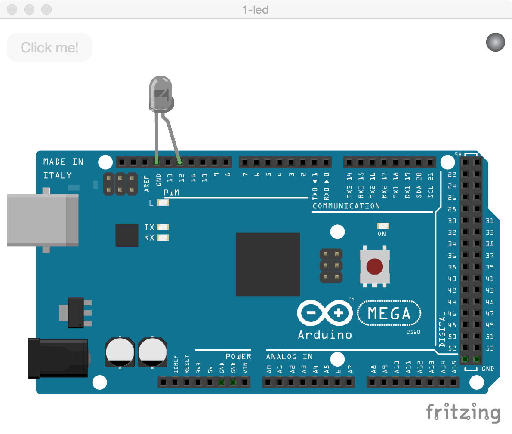

#1-led
**This app allows you to control an LED**

##Setting up the hardware

I used an [arduino mega](https://www.arduino.cc/en/Main/ArduinoBoardMega2560) for this example, but any of the [boards](http://johnny-five.io/platform-support/) supported by johnny-five should work.

Connect an LED directly to pin 12


##Setting up the code


To run, first clone the repo and npm install the example directory

```
git clone https://github.com/sofroniewn/electron-johnny-five-examples
cd electron-johnny-five-examples/1-led
npm install
```

Unfortunately the serial port may not work right away and might need to be rebuilt

```
./node_modules/.bin/electron-rebuild
```

At this point if you try to starting the app with

```
npm start
```
You may get an error if the path to <code>serialport.node</code> is wrong.

```
Uncaught Error: Cannot find module '/Users/sofroniewn/github/electron-johnny-five-examples/1-led/node_modules/johnny-five/node_modules/serialport/build/Release/node-v47-darwin-x64/serialport.node'
```

This can easily be fixed by

```
mv ./node_modules/johnny-five/node_modules/serialport/build/Release/electron-v0.36-darwin-x64/ ./node_modules/johnny-five/node_modules/serialport/build/Release/node-v47-darwin-x64/
```

You're now ready to start the app!

For more information about that error and using electron with johnny-five and node-serialport in general, check out this super helpful [blog post](http://meow.noopkat.com/using-node-serialport-in-an-electron-app/) by [@noopkat](https://github.com/noopkat)

##Running the app
After setting up the [hardware](https://github.com/sofroniewn/electron-johnny-five-examples/tree/master/1-led#setting-up-the-hardware) and [code](https://github.com/sofroniewn/electron-johnny-five-examples/tree/master/1-led#setting-up-the-code) you are now ready to start the app. Run 

```
npm start
```

You should see a screen that looks like this:



The Click me! button is currently disabled and the status light in the top right corner is grey as the app searches for board.

Once the board is ready the status light will turn green and button will become enabled. The screen should now look like this:


If you click the button the LED should turn on!


