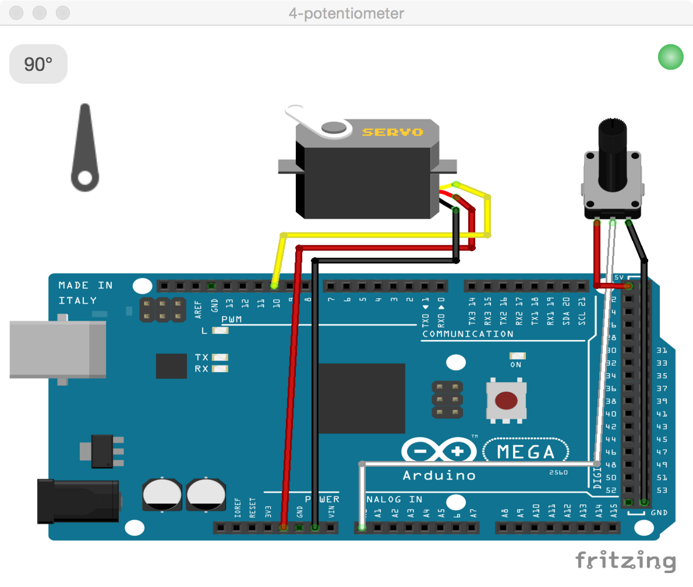

#4-potentiometer
**This app controls a servo based on a potentiometer**

##Setting up the hardware

I used an [arduino mega](https://www.arduino.cc/en/Main/ArduinoBoardMega2560) for this example, but any of the [boards](http://johnny-five.io/platform-support/) supported by johnny-five should work.

Connect a servo motor directly to pin 10 and a potentiometer to A0


##Setting up the code


To run, first clone the repo and npm install the example directory

```
git clone https://github.com/sofroniewn/electron-johnny-five-examples
cd electron-johnny-five-examples/4-potentiometer
npm install
```

Unfortunately the serial port may not work right away and might need to be rebuilt

```
./node_modules/.bin/electron-rebuild
```

At this point if you try to starting the app with

```
npm start
```
You may get an error if the path to <code>serialport.node</code> is wrong

```
Uncaught Error: Cannot find module '/Users/sofroniewn/github/electron-johnny-five-examples/1-led/node_modules/johnny-five/node_modules/serialport/build/Release/node-v47-darwin-x64/serialport.node'
```

This can easily be fixed by

```
mv ./node_modules/johnny-five/node_modules/serialport/build/Release/electron-v0.36-darwin-x64/ ./node_modules/johnny-five/node_modules/serialport/build/Release/node-v47-darwin-x64/
```

You're now ready to run the app!

For more information about that error and using electron with johnny-five and node-serialport in general, check out this super helpful [blog post](http://meow.noopkat.com/using-node-serialport-in-an-electron-app/) by [@noopkat](https://github.com/noopkat)

##Running the app
After setting up the [hardware](https://github.com/sofroniewn/electron-johnny-five-examples/tree/master/4-potentiometer#setting-up-the-hardware) and the [code](https://github.com/sofroniewn/electron-johnny-five-examples/tree/master/4-potentiometer#setting-up-the-code) you are now ready to run the app with 

```
npm start
```

Once the board has been found and the green status light in the top right has turned on, you should be able to control the servo by turning the potentiometer. The position of the servo is displayed in the top left corner. This servo has a range of 45° to 135°.



**Congrats!** Check out the next example [5-sensor](https://github.com/sofroniewn/electron-johnny-five-examples/tree/master/5-sensor)