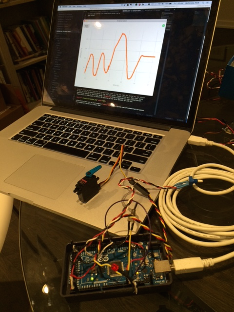

#Electron + Johnny-Five

**This repo contains examples of [electron apps](http://electron.atom.io/) that control [hardware](http://johnny-five.io/platform-support/) using [johnny-five](http://johnny-five.io/) and visualize the results using [lightning](http://lightning-viz.org/).**

If you are new to johnny-five, you might want to first check out this great [nodeschool](http://nodeschool.io/) [workshop on nodebots](https://github.com/tableflip/nodebot-workshop). If you are new to electron you might want to first check out this great [tutorial on making an electron app](https://medium.com/developers-writing/building-a-desktop-application-with-electron-204203eeb658).

Each example is [npm](https://www.npmjs.com/) installable and comes with its own README.md. To get started, check out [1-led](https://github.com/sofroniewn/electron-johnny-five-examples/tree/master/1-led)!

---

## Examples
- [1-led](https://github.com/sofroniewn/electron-johnny-five-examples/tree/master/1-led)
This app allows you to control an LED

- [2-switch](https://github.com/sofroniewn/electron-johnny-five-examples/tree/master/2-switch)
This app controls and LED based on a switch

- [3-servo](https://github.com/sofroniewn/electron-johnny-five-examples/tree/master/3-servo)
This app allows you to control a servo motor

- [4-potentiometer](https://github.com/sofroniewn/electron-johnny-five-examples/tree/master/4-potentiometer)
This app controls a servo based on a potentiometer

- [5-sensor](https://github.com/sofroniewn/electron-johnny-five-examples/tree/master/5-sensor)
This app reads the values of a potentiometer and plots them

- [6-sensor-servo](https://github.com/sofroniewn/electron-johnny-five-examples/tree/master/6-sensor-servo)
This app controls a servo based on a potentiometer and plots the servo position

- [7-sensor-led](https://github.com/sofroniewn/electron-johnny-five-examples/tree/master/7-sensor-led)
This app plots the values a potentiometer and turns on an LED if a voltage threshold is crossed

- [8-sensor-strobe](https://github.com/sofroniewn/electron-johnny-five-examples/tree/master/8-sensor-strobe)
This app allows you to output a strobe at different frequencies and plots the values of analog sensor

- [9-sensor-log](https://github.com/sofroniewn/electron-johnny-five-examples/tree/master/9-sensor-log)
This app allows you to output a strobe at different frequencies, plots the values of analog sensor, and logs timestamped information as JSON

- [10-vr](https://github.com/sofroniewn/electron-johnny-five-examples/tree/master/10-vr)
This app reads the values of a potentiometer and uses it to control left right position in a 3D environment made using [regl](https://github.com/mikolalysenko/regl)

---
## Setup

